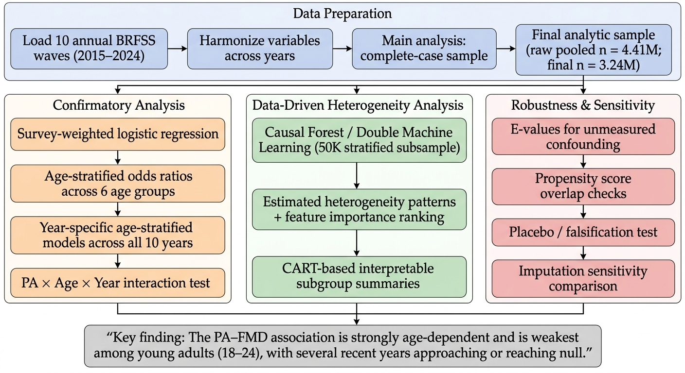

# Age-Dependent Heterogeneity in the Association Between Physical Activity and Mental Distress

**A causal machine learning analysis of 3.2 million U.S. adults from the Behavioral Risk Factor Surveillance System (BRFSS), 2015--2024.**

> Yuan Shan, Department of Statistical Science, Duke University

## Key Findings

1. **Physical activity (PA) is associated with 38% lower odds of frequent mental distress (FMD)** overall (adjusted OR = 0.622, 95% CI: 0.612--0.632), consistent with prior large-scale evidence.

2. **The protective effect is profoundly age-dependent**: OR ranges from 0.89 (18--24, weak) to 0.50 (55--64, strong), forming a monotonic gradient that has not been previously documented in the literature.

3. **The young-adult PA effect has been eroding over the decade**: the 18--24 PA OR reached null (OR = 1.007) in both 2018 and 2024, paralleling the deepening youth mental health crisis.

4. **Causal Forest analysis confirms age as the dominant driver** of treatment effect heterogeneity (feature importance = 0.39, 2.5x the next feature), validating the finding through nonparametric causal machine learning.

## Analytical Pipeline



## Age-Stratified Results (Pooled 2015--2024, n = 3,242,218)

| Age Group | PA Odds Ratio | 95% CI | Interpretation |
|-----------|:------------:|--------|----------------|
| 18--24 | 0.892 | (0.863, 0.923) | Weak protection (11% lower odds) |
| 25--34 | 0.799 | (0.781, 0.817) | |
| 35--44 | 0.665 | (0.652, 0.678) | |
| 45--54 | 0.529 | (0.520, 0.539) | |
| 55--64 | 0.505 | (0.497, 0.513) | Strong protection (50% lower odds) |
| 65+ | 0.533 | (0.526, 0.541) | |

## Repository Structure

```
├── arxiv/                      # Paper (LaTeX -> PDF, arXiv-ready)
│   ├── main.tex                    # Main LaTeX source
│   ├── main.bbl                    # Pre-compiled bibliography
│   ├── references.bib              # BibTeX source (25 citations)
│   └── figures/                    # All paper figures (PNG)
│
├── src/                        # Analysis pipeline (run in order)
│   ├── 01_data_harmonize.py        # Load & harmonize 10 annual BRFSS waves
│   ├── 02_imputation.py            # Conditional imputation for missing income
│   ├── 03_survey_logistic.py       # Survey-weighted logistic regression
│   ├── 04_temporal_validation.py   # Year-by-year age-stratified ORs
│   ├── 05_causal_forest.py         # CausalForestDML (HTE discovery)
│   ├── 06_robustness.py            # E-values, propensity overlap, placebo test
│   └── 07_figures.py               # Publication-quality figures
│
├── data/                       # Raw & processed data (see data/README.md)
├── tables/                     # Analysis outputs (CSV, JSON)
├── dcc/                        # SLURM job script for Duke Compute Cluster
└── requirements.txt            # Python dependencies
```

## Reproducing the Analysis

### Prerequisites

```bash
pip install -r requirements.txt
```

### Data

Download the 10 annual BRFSS XPT files (2015--2024) from the CDC as described in [`data/README.md`](data/README.md).

### Pipeline

Run scripts sequentially from the project root:

```bash
python src/01_data_harmonize.py      # ~4 min  — loads 10 x 1GB XPT files
python src/02_imputation.py          # ~5 sec
python src/03_survey_logistic.py     # ~3 min
python src/04_temporal_validation.py # ~1 min
python src/05_causal_forest.py       # ~60 min — use dcc/dcc_job.sh on HPC cluster
python src/06_robustness.py          # ~2 min
python src/07_figures.py             # ~5 sec
```

Step 5 (Causal Forest) is computationally intensive. A SLURM job script for HPC clusters is provided in [`dcc/dcc_job.sh`](dcc/dcc_job.sh).

### Compile Paper

The paper source is in `arxiv/`. Compile with any standard TeX distribution:

```bash
cd arxiv && pdflatex main && bibtex main && pdflatex main && pdflatex main
```

Or upload `arxiv/` to [Overleaf](https://www.overleaf.com/) for online compilation.

## Methods

| Method | Purpose | Sample |
|--------|---------|--------|
| Survey-weighted logistic regression | Confirmatory age-stratified effect estimates | Full (n = 3.24M) |
| Causal Forest via Double ML (EconML) | Data-driven HTE discovery + feature importance | Subsample (n = 50K) |
| Temporal validation | Year-by-year replication across 10 annual waves | Full, per-year |
| E-values | Sensitivity to unmeasured confounding | Full |
| Propensity score overlap | Positivity assumption check | Subsample (n = 200K) |
| Placebo test | Falsification via predetermined outcome | Full |
| Imputation comparison | Sensitivity to missing income data | Full vs. imputed |

## Data

All data are publicly available from the CDC BRFSS Annual Survey Data repository:
https://www.cdc.gov/brfss/annual_data/annual_data.htm

## License

This project is for academic research purposes. The BRFSS data are public domain.
