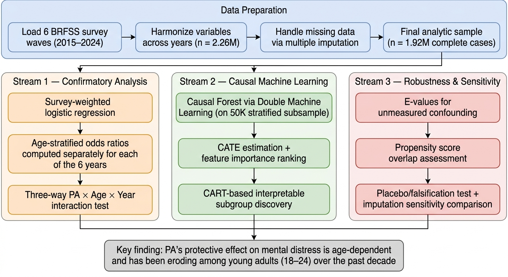

# Age-Dependent Heterogeneity in the Association Between Physical Activity and Mental Distress

A causal machine learning analysis of 3.2 million U.S. adults from the Behavioral Risk Factor Surveillance System (BRFSS), 2015–2024.

## Key Findings

1. **Physical activity (PA) is associated with 38% lower odds of frequent mental distress (FMD)** overall (adjusted OR = 0.622, 95% CI: 0.612–0.632), consistent with prior large-scale evidence.

2. **The protective effect is profoundly age-dependent**: OR ranges from 0.89 (18–24, weak) to 0.50 (55–64, strong), forming a monotonic gradient not previously documented in the literature.

3. **The young-adult PA effect has been eroding over the decade**: the 18–24 PA OR reached null (1.007) in both 2018 and 2024, paralleling the deepening youth mental health crisis.

4. **Causal Forest analysis confirms age as the dominant driver** of treatment effect heterogeneity (feature importance = 0.39, 2.5x the next feature), validating the finding through nonparametric causal machine learning.

## Analytical Pipeline



## Repository Structure

```
├── arxiv/                  # Paper (LaTeX → PDF, arXiv-ready)
│   ├── main.tex                # Main LaTeX source
│   ├── main.bbl                # Pre-compiled bibliography
│   ├── references.bib          # BibTeX source (25 citations)
│   └── figures/                # All paper figures (PNG)
│
├── src/                    # Analysis pipeline (run in order)
│   ├── 01_data_harmonize.py    # Load & harmonize 10 BRFSS years
│   ├── 02_imputation.py        # Imputation for missing income
│   ├── 03_survey_logistic.py   # Survey-weighted logistic regression
│   ├── 04_temporal_validation.py  # Year-by-year age-stratified ORs
│   ├── 05_causal_forest.py     # CausalForestDML (HTE discovery)
│   ├── 06_robustness.py        # E-values, propensity overlap, placebo
│   └── 07_figures.py           # Publication-quality figures
│
├── data/                   # Raw & processed data (see data/README.md)
├── tables/                 # Analysis outputs (CSV, JSON)
├── figures/                # Publication figures (PNG)
├── dcc/                    # SLURM job script for Duke Compute Cluster
└── requirements.txt        # Python dependencies
```

## Reproducing the Analysis

### Prerequisites

```bash
pip install -r requirements.txt
```

### Data

Download the 10 annual BRFSS XPT files (2015–2024) as described in [`data/README.md`](data/README.md).

### Pipeline

Run scripts sequentially from the project root:

```bash
python src/01_data_harmonize.py     # ~4 min (loads 10 × 1GB files)
python src/02_imputation.py         # ~5 sec
python src/03_survey_logistic.py    # ~3 min
python src/04_temporal_validation.py # ~1 min
python src/05_causal_forest.py      # ~60 min (or use dcc/dcc_job.sh on cluster)
python src/06_robustness.py         # ~2 min
python src/07_figures.py            # ~5 sec
```

Step 5 (Causal Forest) is computationally intensive. A SLURM job script for HPC clusters is provided in `dcc/dcc_job.sh`.

## Methods

- **Survey-weighted logistic regression** with cluster-robust standard errors on 3.24M complete-case observations
- **Causal Forest via Double Machine Learning** (EconML `CausalForestDML`) with HistGradientBoosting nuisance models
- **Temporal validation** across 10 independent annual BRFSS waves (2015–2024)
- **Sensitivity analyses**: E-values for unmeasured confounding, propensity score overlap, placebo/falsification test, complete-case vs. imputation comparison

## Data

All data are publicly available from the CDC BRFSS:
https://www.cdc.gov/brfss/annual_data/annual_data.htm

## Author

Yuan Shan, Department of Statistical Science, Duke University

## License

This project is for academic research purposes. The BRFSS data are public domain.
