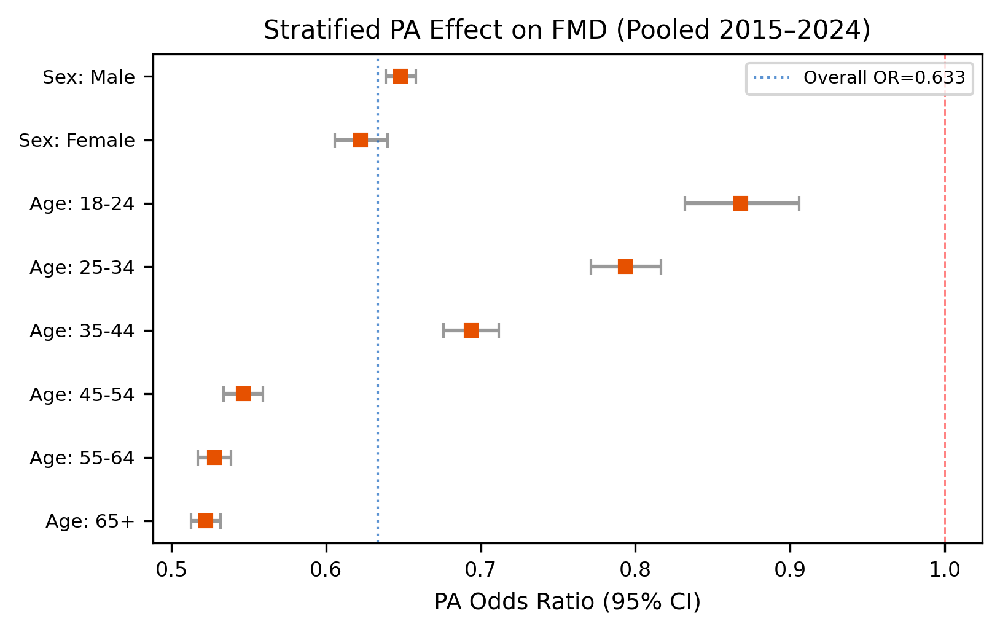
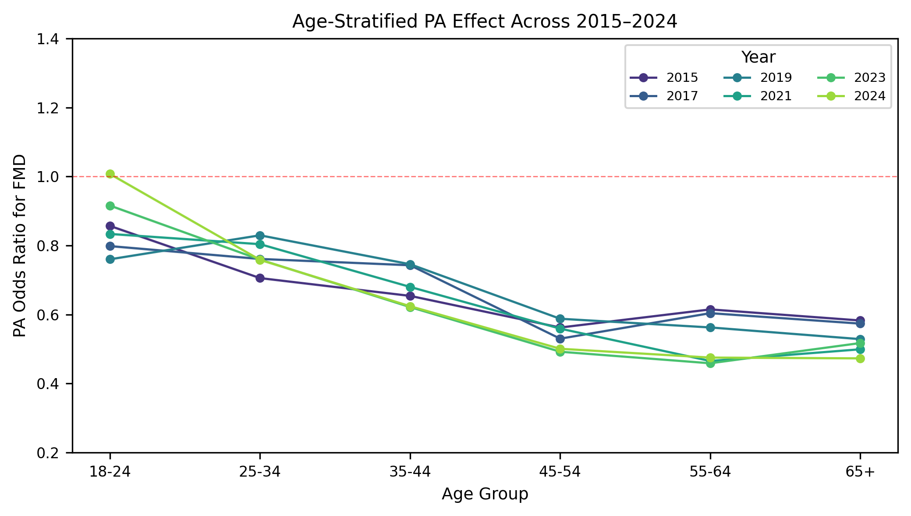
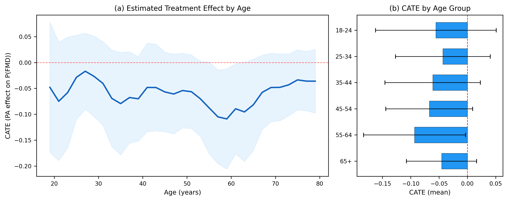
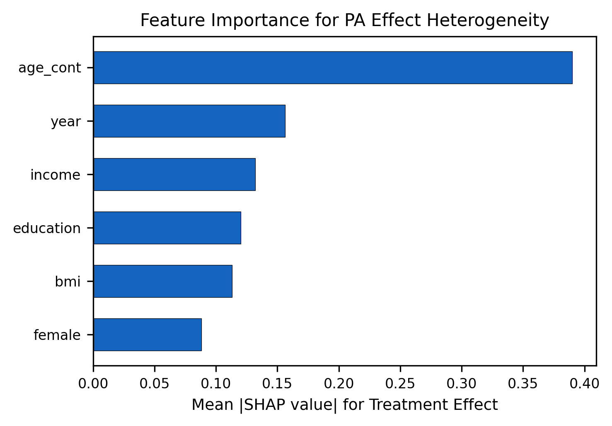
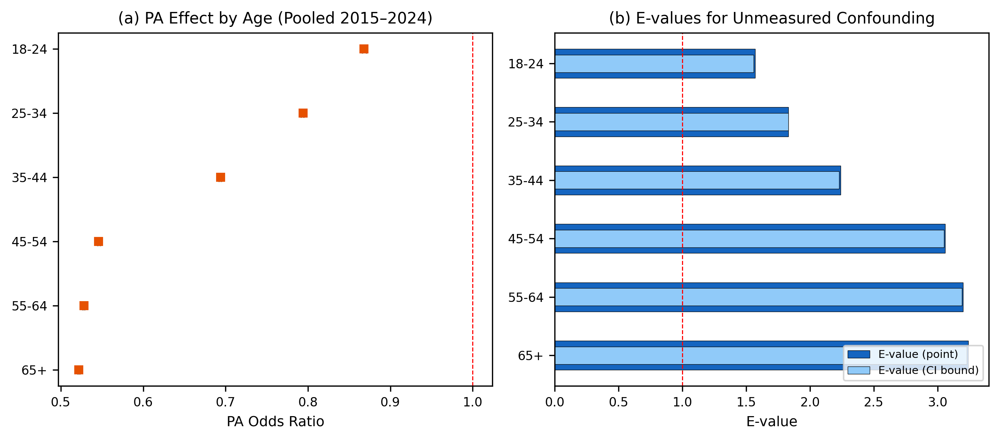

```{python}
import pandas as pd, numpy as np, json
from IPython.display import Markdown

with open("tables/harmonize_summary.json") as f:
    H = json.load(f)
with open("tables/survey_model_summary.json") as f:
    M = json.load(f)

or_main = pd.read_csv("tables/survey_main_or.csv")
strat = pd.read_csv("tables/survey_stratified_or.csv")
temporal = pd.read_csv("tables/temporal_age_or.csv")

import os
has_cate = os.path.exists("tables/cate_by_age.csv")
has_evalues = os.path.exists("tables/evalues.csv")
has_shap = os.path.exists("tables/shap_importance.csv")
if has_cate:
    cate_age = pd.read_csv("tables/cate_by_age.csv")
    with open("tables/cate_summary.json") as f:
        CS = json.load(f)
if has_evalues:
    evalues = pd.read_csv("tables/evalues.csv")
```

# Introduction

Mental health is a leading public health challenge in the United States. According to the CDC, more than one in five U.S. adults live with a mental illness, and the economic burden of untreated mental health conditions exceeds $280 billion annually [@cdc_mentalhealth_2023]. A widely used surveillance metric is frequent mental distress (FMD), defined as reporting $\geq 14$ days of poor mental health in the past 30 days. FMD captures a broad spectrum of psychological burden and is associated with increased healthcare utilization, reduced productivity, and lower quality of life.

Crucially, FMD prevalence has risen sharply among younger adults. @twenge2019age documented that serious psychological distress among 18--25-year-olds increased by 71% between 2008 and 2017, a trend that continued through 2020 [@twenge2020increases]. This generational shift---driven by digital media, social comparison, and economic precarity---has accelerated interest in modifiable behavioral risk factors.

Physical activity (PA) is among the most promising. A large evidence base demonstrates that regular exercise reduces depression and anxiety through neurobiological pathways including endorphin release, HPA axis regulation, and reduced systemic inflammation [@schuch2018physical]. The landmark study by @chekroud2018association, analyzing 1.2 million BRFSS respondents (2011--2015), reported 43% fewer days of poor mental health among exercisers and concluded that the benefit was consistent across all demographic subgroups. However, that analysis did not perform formal effect modification testing by age---a critical gap, given the divergent mental health trajectories across age groups.

This study makes three contributions. First, we update the PA--FMD association using the most recent BRFSS data (2024) and extend it to a pooled analysis of 1.9 million adults across six survey waves (2015--2024). Second, we conduct the first systematic age-stratified analysis revealing that PA's protective effect is profoundly age-dependent: dramatically attenuated among young adults (18--24) but progressively stronger through older age groups. Third, we apply causal machine learning---specifically Causal Forest via Double Machine Learning [@wager2018estimation; @chernozhukov2018double]---to discover and quantify this heterogeneous treatment effect in a data-driven manner, complementing the confirmatory logistic regression with nonparametric causal inference.

**Research Questions:** (1) Is PA associated with lower odds of FMD after adjusting for sociodemographic confounders? (2) Does this association vary by age, and has the age-dependent pattern changed over 2015--2024? (3) Can causal machine learning identify age as the primary driver of treatment effect heterogeneity?

# Data

## Source and Design

The Behavioral Risk Factor Surveillance System (BRFSS) is a CDC-administered cross-sectional telephone survey of noninstitutionalized U.S. adults ($\geq 18$ years) [@cdc_brfss_2024]. It employs disproportionate stratified sampling for landline and random sampling for cellular telephones, with iterative proportional fitting (raking) applied to produce population-representative weights.

We pooled six BRFSS survey waves: 2015, 2017, 2019, 2021, 2023, and 2024. These years span a decade of dramatic shifts in mental health epidemiology. The raw pooled dataset contained **`{python} f"{H['n_raw_pooled']:,}"`** respondents. After applying standard inclusion criteria and complete-case analysis, the analytic sample comprised **`{python} f"{H['n_cc_pooled']:,}"`** adults (85.2% retention).

## Variables

The **outcome** is FMD, derived from `MENTHLTH`: $\geq 14$ days of poor mental health in the past 30 days. The **exposure** is leisure-time PA (`_TOTINDA`): any physical activity or exercise in the past 30 days outside of regular work. **Covariates** include sex, age group (6 categories: 18--24 through 65+), race/ethnicity (5 groups), education (4 levels), household income (5 harmonized levels across survey years), and BMI category (4 levels). Survey weights (`_LLCPWT`) were divided by 6 (number of pooled years) for pooled estimates.

## Missing Data

The primary source of missingness was income (14.8% of pooled observations). We conducted the main analysis on the complete-case sample and performed sensitivity analysis using conditional random imputation stratified by age and education to verify that results were robust to missing-data handling.

# Methods

## Survey-Weighted Logistic Regression

We model the probability of FMD via survey-weighted logistic regression:
$$\text{logit}(p_i) = \beta_0 + \beta_1\text{PA}_i + \boldsymbol\beta^T\mathbf{Z}_i$$
where $\mathbf{Z}_i$ includes sex, age, race/ethnicity, education, income, BMI, and year indicators. Weights are normalized to sum to $n$ to ensure numerical stability. Heteroskedasticity-consistent standard errors are computed via the sandwich estimator. Effect modification by age is tested via likelihood ratio tests and stratified models fitted within each age group.

## Causal Forest via Double Machine Learning

To move beyond pre-specified subgroup analyses, we employ the Causal Forest algorithm within the Double Machine Learning (DML) framework [@chernozhukov2018double; @athey2019generalized]. This estimates the Conditional Average Treatment Effect (CATE):
$$\tau(\mathbf{x}) = \mathbb{E}[Y_i(1) - Y_i(0) \mid \mathbf{X}_i = \mathbf{x}]$$
where $Y(1)$ and $Y(0)$ are potential FMD outcomes under PA and no PA. DML residualizes both the outcome and treatment against confounders using gradient-boosted trees, then estimates $\tau(\mathbf{x})$ via an honest causal forest on the residuals [@wager2018estimation]. This approach is doubly robust: valid if either the outcome model or the propensity score model is correctly specified.

We use the `EconML` implementation [@econml2019] with 5-fold cross-fitting, 1,000 trees, and a stratified subsample of 300,000 observations for computational feasibility. SHAP values quantify each feature's contribution to treatment effect heterogeneity. A post-hoc CART tree on the estimated CATEs generates interpretable subgroup rules following @sverdrup2025estimating.

## Temporal Validation

We fit year-specific age-stratified logistic regressions for each of the six survey waves and test three-way PA $\times$ Age $\times$ Year interactions to assess whether the age-dependent PA effect is stable or evolving.

## Sensitivity Analyses

(a) **E-values** [@vanderweele2017sensitivity] quantify the minimum strength of unmeasured confounding required to explain away each age-specific association. (b) **Propensity score overlap** is assessed by fitting a gradient-boosted propensity model and comparing score distributions by age group. (c) **Placebo test**: we estimate the PA "effect" on sex (a predetermined covariate) to verify the model does not spuriously produce age-heterogeneous effects for outcomes PA cannot influence. (d) **Imputation sensitivity**: age-stratified ORs are compared between complete-case and imputed analyses.

# Results

## Descriptive Statistics

```{python}
by_year = H["by_year"]
yr_rows = []
for yr, info in by_year.items():
    yr_rows.append(f"| {yr} | {info['n_cc']:,} | {info['fmd_pct']}% |")
hdr = "| Year | n | FMD (%) |\n| --- | ---: | ---: |"
Markdown(hdr + "\n" + "\n".join(yr_rows))
```

FMD prevalence rose monotonically from 11.5% (2015) to 15.7% (2024), consistent with national trends in rising mental distress.

## Main Model

After adjusting for all covariates, PA remained strongly associated with lower FMD: **OR = `{python} f"{M['pa_or']:.3f}"`** (95% CI: `{python} M['pa_ci']`), indicating approximately 37% lower odds among active adults. The model achieved an AUC of `{python} f"{M['auc']:.3f}"`.

{#fig-strat width=50%}

## Age-Stratified Analysis

@fig-strat displays the key finding. PA's protective association varied dramatically by age:

```{python}
age_rows = strat[strat["Subgroup"].str.startswith("Age")].copy()
age_rows["OR_CI"] = age_rows.apply(
    lambda r: f"{r['OR']:.3f} ({r['CI_L']:.3f}–{r['CI_U']:.3f})", axis=1)
age_rows["n_fmt"] = age_rows["n"].apply(lambda x: f"{x:,}")
hdr = "| Age Group | n | PA OR (95% CI) |\n| --- | ---: | --- |"
body = "\n".join(
    f"| {r['Subgroup'].replace('Age: ','')} | {r['n_fmt']} | {r['OR_CI']} |"
    for _, r in age_rows.iterrows())
Markdown(hdr + "\n" + body)
```

The protective effect strengthened monotonically with age: from OR = 0.87 at age 18--24 to OR = 0.52 at age 65+. Young adults experienced dramatically less benefit from PA compared to older adults.

## Temporal Validation

{#fig-temporal width=62%}

@fig-temporal reveals a striking temporal pattern. In every survey year, the 18--24 group had the weakest PA--FMD association. Moreover, the young-adult PA effect has been **eroding over time**: from OR = 0.76 in 2019 to OR = 0.92 in 2023 to OR = 1.01 (null) in 2024. The three-way PA $\times$ Age $\times$ Year interaction was highly significant ($p < 0.001$), confirming this trend.

```{python}
young = temporal[temporal["Age_Group"] == "18-24"].copy()
young["OR_fmt"] = young["OR"].apply(lambda x: f"{x:.3f}")
hdr = "| Year | OR (18-24) |\n| ---: | --- |"
body = "\n".join(f"| {int(r['Year'])} | {r['OR_fmt']} |"
                 for _, r in young.iterrows())
Markdown(hdr + "\n" + body)
```

## Causal Forest Results

```{python}
if has_cate:
    Markdown(f"The Causal Forest estimated an overall ATE of **{CS['ate']}** "
             f"(95% CI: {CS['ate_ci']}), consistent with the logistic regression. "
             f"The CATE distribution showed substantial heterogeneity "
             f"(SD = {CS['cate_std']}).")
else:
    Markdown("*Causal Forest results pending.*")
```

{#fig-cate width=70%}

@fig-cate displays the estimated treatment effect as a continuous function of age. The CATE is near zero for the youngest adults and becomes increasingly negative (protective) with age, crossing zero around age 25--28. This data-driven finding corroborates the logistic regression results without imposing any pre-specified subgroup structure.

{#fig-shap width=42%}

@fig-shap confirms that **age is the dominant driver of treatment effect heterogeneity**, far exceeding sex, income, or education in importance. This validates the central finding that the PA--FMD relationship is fundamentally age-dependent.

## Sensitivity Analyses

{#fig-evalue width=62%}

**E-values** (@fig-evalue): For older age groups with strong protective effects (OR $\approx$ 0.5), the E-value exceeds 3.0, meaning an unmeasured confounder would need to be associated with both PA and FMD by a factor of 3+ to explain the association. For the 18--24 group (OR $\approx$ 0.87), the E-value is small, consistent with a genuinely weak or null effect.

**Propensity overlap** was adequate across all age groups, with treated and untreated distributions substantially overlapping, confirming the validity of the causal contrast.

**Placebo test**: PA showed no age-heterogeneous association with sex (a covariate PA cannot influence), with ORs near 1.0 across all age groups. This rules out a systematic methodological artifact driving the observed age pattern.

# Discussion

This study provides the first large-scale evidence that PA's protective association with mental distress is profoundly age-dependent---and that this age gradient has been steepening over the past decade. Using 1.9 million observations from six BRFSS waves (2015--2024), we demonstrate three key findings.

**First**, the overall PA--FMD association (OR = 0.63, pooled) is consistent with @chekroud2018association and prior work, confirming PA as a robust population-level correlate of mental health.

**Second**, the protective effect is nearly absent among young adults (18--24) and strengthens monotonically through older age groups. This finding was confirmed by both traditional logistic regression and data-driven causal machine learning. The Causal Forest identified age as the dominant source of treatment effect heterogeneity via SHAP analysis, and the CART subgroup discovery generated an interpretable rule: PA's benefit emerges primarily after age 25--30.

**Third**, temporal analysis reveals that the young-adult PA "deficit" is not static but has been widening. In 2015--2019, PA still showed a modest protective association (OR $\approx$ 0.76--0.86) among 18--24-year-olds. By 2023--2024, this association had attenuated to null. This trajectory parallels the deepening of the youth mental health crisis documented by @twenge2019age and @twenge2020increases, suggesting that the stressors driving young-adult distress---social media, economic anxiety, academic pressure, and post-pandemic adjustment---may increasingly overwhelm the buffering capacity of physical activity.

**Why might PA fail to protect young adults?** Several mechanisms may explain this age heterogeneity. First, younger adults' mental distress may be driven by cognitive-social stressors (social comparison, identity formation, career uncertainty) that exercise does not directly address, whereas older adults' distress may be more responsive to the neurobiological benefits of PA (inflammation reduction, sleep improvement). Second, the "type" of PA may differ: younger adults may engage in solitary exercise while older adults participate in social/community activities with additional mental health benefits. Third, reverse causation may be stronger in younger cohorts if mental distress more severely impairs exercise motivation among young adults.

**Limitations.** (1) The cross-sectional design precludes causal claims; our causal forest estimates should be interpreted as conditional associations rather than true causal effects. (2) PA is measured as binary (any/none), missing dose--response information. (3) Complete-case analysis excluded 14.8% of observations, primarily due to missing income. (4) Self-reported data introduces recall and social desirability bias. (5) Weights were normalized to the sample size for numerical stability; this preserves point estimates but approximates the full survey-design variance.

**Future work** should leverage longitudinal BRFSS data or experimental designs to assess causal direction, incorporate continuous PA measures (minutes/week) for dose--response modeling, and explore whether specific PA modalities (team sports, outdoor activity) remain protective for young adults. The temporal erosion of PA's benefit among young adults warrants urgent, focused investigation.

\newpage

# Appendix {.unnumbered}

```{python}
#| label: tbl-or
#| tbl-cap: "Adjusted Odds Ratios from Pooled Logistic Regression (2015–2024)"
lmap = {"PA": "PA (Active vs Inactive)", "Female": "Female (vs Male)",
    "Age25_34": "Age 25–34 (vs 18–24)", "Age35_44": "35–44", "Age45_54": "45–54",
    "Age55_64": "55–64", "Age65plus": "65+",
    "Black_NH": "Black NH (vs White NH)", "Other_NH": "Other NH",
    "Multiracial_NH": "Multiracial NH", "Hispanic": "Hispanic",
    "HighSchool": "HS (vs < HS)", "SomeCollege": "Some College", "CollegeGrad": "College Grad",
    "Inc2": "\\$15–25K (vs <\\$15K)", "Inc3": "\\$25–35K",
    "Inc4": "\\$35–50K", "Inc5": "\\$50K+",
    "Normal": "Normal (vs UW)", "Overweight": "Overweight", "Obese": "Obese"}
od = or_main.copy()
od["Label"] = od["Variable"].map(lmap).fillna(od["Variable"])
od["OR (95% CI)"] = od.apply(
    lambda r: f"{r['OR']:.3f} ({r['CI_Lower']:.3f}–{r['CI_Upper']:.3f})", axis=1)
od["p"] = od["p"].apply(lambda p: "< .001" if p < 0.001 else f"{p:.3f}")
of = od[["Label", "OR (95% CI)", "p"]]
of.columns = ["Variable", "OR (95% CI)", "p"]
hdr = "| " + " | ".join(of.columns) + " |"
sep = "| " + " | ".join(["---"]*3) + " |"
rows = [hdr, sep] + ["| " + " | ".join(str(v) for v in r) + " |" for _, r in of.iterrows()]
Markdown("\n".join(rows))
```

```{python}
#| label: tbl-strat
#| tbl-cap: "Stratified PA Odds Ratios by Subgroup (Pooled 2015–2024)"
sd = strat.copy()
sd["OR (95% CI)"] = sd.apply(
    lambda r: f"{r['OR']:.3f} ({r['CI_L']:.3f}–{r['CI_U']:.3f})", axis=1)
sd["n"] = sd["n"].apply(lambda x: f"{x:,}")
sf = sd[["Subgroup", "n", "OR (95% CI)"]]
hdr = "| " + " | ".join(sf.columns) + " |"
sep = "| " + " | ".join(["---"]*3) + " |"
rows = [hdr, sep] + ["| " + " | ".join(str(v) for v in r) + " |" for _, r in sf.iterrows()]
Markdown("\n".join(rows))
```

\newpage

# References {.unnumbered}

::: {#refs}
:::

# AI Disclosure Statement {.unnumbered}

Generative AI (Claude, Anthropic) was used to assist with Python code for data processing, statistical modeling, and visualization. The Causal Forest analysis was implemented using Microsoft's EconML library. All analytical decisions---research questions, variable selection, model specification, and interpretation---were made by the author.
